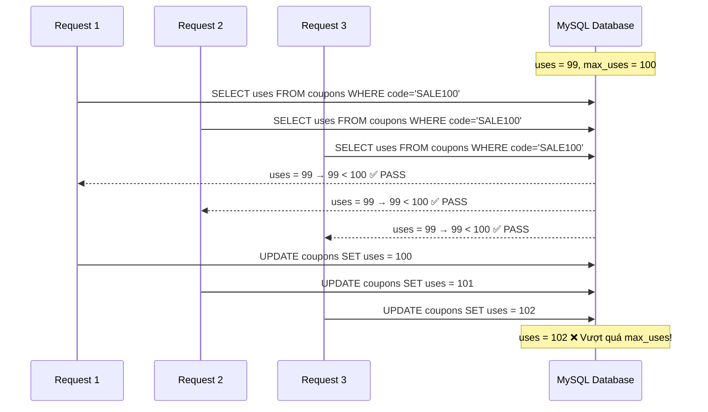
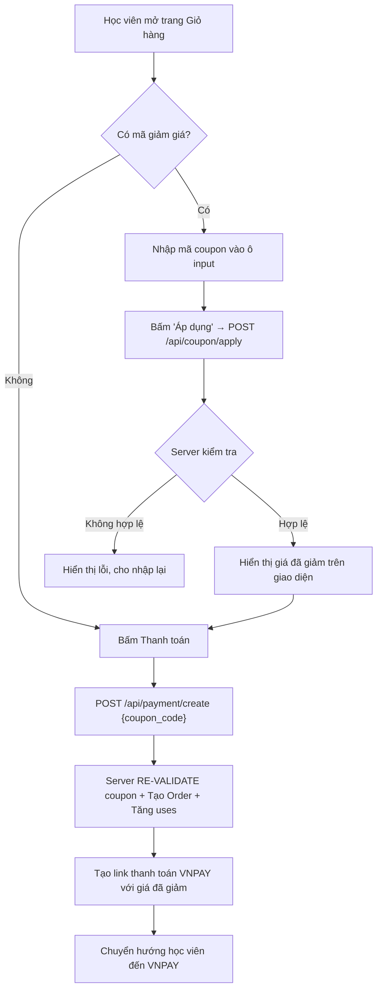

# 🎟️ SPEC: Tính năng Coupon (Mã giảm giá)

## 1. Tổng quan

Tính năng Coupon cho phép hệ thống hỗ trợ hai loại mã giảm giá:
- **Course Coupon**: Mã giảm giá dành riêng cho một khóa học cụ thể, số lượng có hạn, không cần điều kiện áp dụng.
- **System Coupon**: Mã giảm giá do Admin hệ thống tạo, áp dụng chung cho toàn bộ đơn hàng, có các điều kiện ràng buộc.

---

## 2. Phân loại Coupon

### 2.1. Course Coupon (Mã giảm giá theo khóa học)

| Thuộc tính | Mô tả |
|---|---|
| **Phạm vi** | Chỉ áp dụng cho **đúng 1 khóa học** được chỉ định (`course_id`) |
| **Điều kiện áp dụng** | Không cần điều kiện. Chỉ cần mã hợp lệ, còn hạn, còn lượt dùng |
| **Số lượng** | **Có giới hạn** (`max_uses`). Khi hết lượt → mã không còn hiệu lực |
| **Ai tạo** | Admin (hiện tại). Về sau có thể mở rộng cho Teacher |
| **Ví dụ** | Mã `NODEJS50` giảm 50% cho khóa học "Lập trình NodeJS", giới hạn 100 lượt |

### 2.2. System Coupon (Mã giảm giá hệ thống)

| Thuộc tính | Mô tả |
|---|---|
| **Phạm vi** | Áp dụng cho **toàn bộ đơn hàng** (tổng giá trị giỏ hàng) |
| **Điều kiện áp dụng** | Có điều kiện ràng buộc (xem bên dưới) |
| **Số lượng** | Có giới hạn hoặc không giới hạn (`max_uses = NULL` → vô hạn) |
| **Ai tạo** | Chỉ Admin hệ thống |
| **Ví dụ** | Mã `SUMMER2026` giảm 100.000đ cho đơn hàng từ 500.000đ trở lên |

#### Các điều kiện áp dụng của System Coupon:

| Điều kiện | Mô tả | Ví dụ |
|---|---|---|
| `min_order_amount` | Giá trị đơn hàng tối thiểu | Đơn hàng phải từ 500.000đ |
| `expires_at` | Thời hạn sử dụng | Hết hạn vào 31/07/2026 |
| `max_uses` | Giới hạn tổng lượt dùng toàn hệ thống | Tối đa 1000 lượt |
| `max_uses_per_user` | Giới hạn lượt dùng trên mỗi học viên | Mỗi học viên chỉ dùng 1 lần |

---

## 3. Thiết kế Database

### 3.1. Bảng `coupons` (Tạo mới)

```sql
CREATE TABLE coupons (
    id              BIGINT UNSIGNED AUTO_INCREMENT PRIMARY KEY,
    code            VARCHAR(50) NOT NULL UNIQUE,
    type            ENUM('course', 'system') NOT NULL DEFAULT 'course',
    
    -- Giá trị giảm
    discount_type   ENUM('percent', 'fixed') NOT NULL DEFAULT 'percent',
    discount_value  DECIMAL(12, 2) NOT NULL,       -- 50 = 50% hoặc 100000 = 100.000đ
    
    -- Phạm vi áp dụng
    course_id       BIGINT UNSIGNED NULL,           -- NULL = System Coupon, có giá trị = Course Coupon
    
    -- Điều kiện (chỉ dùng cho System Coupon)
    min_order_amount DECIMAL(12, 2) NOT NULL DEFAULT 0,
    max_uses_per_user INT UNSIGNED NULL DEFAULT NULL, -- NULL = không giới hạn
    
    -- Giới hạn số lượng
    max_uses        INT UNSIGNED NOT NULL DEFAULT 0,  -- 0 = không giới hạn
    uses            INT UNSIGNED NOT NULL DEFAULT 0,  -- Số lượt đã sử dụng
    
    -- Trạng thái & thời hạn
    is_active       BOOLEAN NOT NULL DEFAULT TRUE,
    expires_at      TIMESTAMP NULL DEFAULT NULL,
    
    created_at      TIMESTAMP NULL DEFAULT CURRENT_TIMESTAMP,
    updated_at      TIMESTAMP NULL DEFAULT CURRENT_TIMESTAMP ON UPDATE CURRENT_TIMESTAMP,
    
    FOREIGN KEY (course_id) REFERENCES courses(id) ON DELETE CASCADE
);
```

> [!IMPORTANT]
> Trường `uses` là trường **quan trọng nhất** để test Race Condition. Đây là trường mà nhiều request đồng thời sẽ cùng đọc và ghi, dẫn đến xung đột dữ liệu.

### 3.2. Bảng `coupon_usages` (Tạo mới - Lịch sử sử dụng)

Bảng này phục vụ 2 mục đích: kiểm tra giới hạn lượt dùng trên mỗi học viên (`max_uses_per_user`) và lưu vết lịch sử.

```sql
CREATE TABLE coupon_usages (
    id              BIGINT UNSIGNED AUTO_INCREMENT PRIMARY KEY,
    coupon_id       BIGINT UNSIGNED NOT NULL,
    customer_id     BIGINT UNSIGNED NOT NULL,
    order_id        BIGINT UNSIGNED NOT NULL,
    discount_amount DECIMAL(12, 2) NOT NULL DEFAULT 0,
    
    created_at      TIMESTAMP NULL DEFAULT CURRENT_TIMESTAMP,
    
    FOREIGN KEY (coupon_id) REFERENCES coupons(id) ON DELETE CASCADE,
    FOREIGN KEY (customer_id) REFERENCES customers(id) ON DELETE CASCADE,
    FOREIGN KEY (order_id) REFERENCES orders(id) ON DELETE CASCADE
);
```

### 3.3. Bảng `orders` (Cập nhật - Thêm cột)

```sql
ALTER TABLE orders
    ADD COLUMN coupon_code VARCHAR(50) NULL AFTER status,
    ADD COLUMN discount_amount INT NOT NULL DEFAULT 0 AFTER coupon_code;
```

> [!NOTE]
> Cột `amount` hiện tại trong bảng `orders` sẽ lưu **số tiền thực tế sau khi đã trừ giảm giá**. Cột `discount_amount` mới thêm sẽ lưu **số tiền được giảm** để dễ dàng tra cứu và đối soát.

### 3.4. Bảng `order_items` (Cập nhật - Thêm cột)

```sql
ALTER TABLE order_items
    ADD COLUMN coupon_code VARCHAR(50) NULL AFTER price,
    ADD COLUMN discount_amount DECIMAL(12, 2) NOT NULL DEFAULT 0 AFTER coupon_code;
```

> [!NOTE]
> Cần thêm `coupon_code` và `discount_amount` vào `order_items` để lưu vết **Course Coupon** được áp dụng riêng cho từng khóa học trong đơn hàng.

---

## 4. Thiết kế API

### 4.1. API áp dụng mã Coupon (Kiểm tra trước khi checkout)

```
POST /api/coupon/apply
```

**Headers:**
```
Authorization: Bearer <JWT_TOKEN>
```

**Request Body:**
```json
{
    "coupon_code": "NODEJS50"
}
```

**Logic xử lý trên Server:**

```
1. Tìm coupon theo `code` trong DB
2. Kiểm tra tính hợp lệ:
   a. Coupon có tồn tại không?
   b. Coupon có đang active không? (is_active == true)
   c. Coupon đã hết hạn chưa? (expires_at > now)
   d. Coupon còn lượt dùng không? (uses < max_uses, hoặc max_uses == 0)
3. Nếu là Course Coupon (course_id != NULL):
   → Kiểm tra khóa học đó có trong giỏ hàng của học viên không
   → Tính discount_amount dựa trên giá khóa học đó
4. Nếu là System Coupon (course_id == NULL):
   → Tính tổng giá trị giỏ hàng
   → Kiểm tra min_order_amount
   → Kiểm tra max_uses_per_user (đếm số lượt đã dùng trong bảng coupon_usages)
   → Tính discount_amount dựa trên tổng giá trị giỏ hàng
5. Trả về kết quả
```

**Response thành công (200):**
```json
{
    "message": "Áp dụng mã giảm giá thành công!",
    "data": {
        "coupon_code": "NODEJS50",
        "coupon_type": "course",
        "discount_type": "percent",
        "discount_value": 50,
        "discount_amount": 250000,
        "applied_to_course_id": 1,
        "applied_to_course_title": "Lập trình NodeJS cơ bản",
        "original_total": 500000,
        "final_total": 250000
    }
}
```

**Response lỗi (400):**
```json
{
    "message": "Mã giảm giá đã hết lượt sử dụng.",
    "data": null
}
```

### 4.2. API Thanh toán (Cập nhật logic hiện có)

```
POST /api/payment/create
```

**Request Body (Cập nhật):**
```json
{
    "coupon_code": "NODEJS50"
}
```

> [!WARNING]
> Backend **BẮT BUỘC** phải re-validate (xác thực lại) mã coupon tại thời điểm tạo đơn hàng. TUYỆT ĐỐI KHÔNG tin tưởng giá trị `discount_amount` gửi từ client. Mọi phép tính giảm giá phải được thực hiện lại trên server.

**Logic xử lý tại PaymentServices::createPayment (Cập nhật):**

```
1. Lấy nội dung giỏ hàng (giữ nguyên logic hiện tại)
2. Tính tổng tiền giỏ hàng (giữ nguyên logic hiện tại)
3. NẾU có coupon_code trong request:
   a. Re-validate coupon (giống logic API apply ở trên)
   b. Tính discount_amount thực tế trên server
   c. final_amount = total_amount - discount_amount
   d. Nếu final_amount < 0 → final_amount = 0
4. Tạo Order với:
   - amount = final_amount
   - coupon_code = mã đã áp dụng
   - discount_amount = số tiền được giảm
5. Tạo OrderItems:
   - Nếu là Course Coupon: ghi coupon_code + discount_amount vào order_item tương ứng
   - Nếu là System Coupon: ghi coupon_code + discount_amount vào bảng orders
6. ★ Tăng uses của coupon lên +1
7. ★ Ghi log vào bảng coupon_usages
8. Xóa giỏ hàng, tạo Payment Transaction, tạo URL VNPAY
   (giữ nguyên logic hiện tại, nhưng gửi final_amount sang VNPAY)
```

> [!CAUTION]
> **Bước 6 chính là điểm xảy ra Race Condition.** Nếu không có cơ chế khóa (locking), nhiều request đồng thời có thể vượt qua bước kiểm tra `uses < max_uses` và cùng tăng `uses` lên, dẫn đến việc coupon bị sử dụng vượt quá giới hạn.

---

## 5. Race Condition Analysis

### 5.1. Kịch bản lỗi (Intentional Bug để test)

**Điều kiện ban đầu:** Coupon `SALE100` có `max_uses = 100`, `uses = 99` (còn đúng 1 lượt cuối).

**Luồng lỗi khi 5 request đồng thời:**



**Kết quả:** 3 đơn hàng đều được giảm giá, nhưng thực tế chỉ có 1 lượt coupon còn lại.

### 5.2. Cách viết code "Ngây thơ" (Phiên bản có Bug - Viết trước)

```php
public function applyCoupon($couponCode, $customerId)
{
    // 1. Tìm coupon
    $coupon = Coupon::where('code', $couponCode)->first();
    if (!$coupon) throw new \Exception('Mã không tồn tại');

    // 2. CHECK: Còn lượt dùng không?
    if ($coupon->max_uses > 0 && $coupon->uses >= $coupon->max_uses) {
        throw new \Exception('Mã đã hết lượt sử dụng');
    }

    // ⚠️ Khoảng trống thời gian giữa CHECK và ACT → Race Condition xảy ra ở đây
    usleep(200000); // Giả lập delay 200ms để dễ tái hiện lỗi khi test

    // 3. ACT: Tăng uses
    $coupon->uses = $coupon->uses + 1;
    $coupon->save();

    return $coupon;
}
```

### 5.3. Các cách Fix Race Condition (Viết sau khi đã test thấy bug)

#### Cách 1: Pessimistic Locking (Khóa bi quan)

```php
DB::transaction(function () use ($couponCode) {
    // lockForUpdate() sẽ khóa hàng này lại,
    // các request khác phải xếp hàng chờ
    $coupon = Coupon::where('code', $couponCode)
        ->lockForUpdate()
        ->first();

    if ($coupon->max_uses > 0 && $coupon->uses >= $coupon->max_uses) {
        throw new \Exception('Mã đã hết lượt sử dụng');
    }

    $coupon->increment('uses');
});
```

#### Cách 2: Atomic Update (Cập nhật nguyên tử - Khuyên dùng)

```php
// Gộp CHECK + ACT thành 1 câu SQL duy nhất
$updated = Coupon::where('code', $couponCode)
    ->where(function ($q) {
        $q->where('max_uses', 0)              // Không giới hạn
          ->orWhereColumn('uses', '<', 'max_uses'); // Hoặc còn lượt
    })
    ->increment('uses');

if ($updated === 0) {
    throw new \Exception('Mã đã hết lượt sử dụng');
}
```

---

## 6. Luồng xử lý tổng thể (User Flow)



---

## 7. Quản lý Coupon trên CMS (Admin)

### 7.1. Giao diện danh sách Coupon

| Cột | Mô tả |
|---|---|
| Mã code | Mã coupon (ví dụ: `NODEJS50`) |
| Loại | `Course Coupon` hoặc `System Coupon` |
| Giảm giá | `50%` hoặc `100.000đ` |
| Khóa học | Tên khóa học (nếu là Course Coupon) hoặc `Toàn bộ` |
| Đã dùng / Tối đa | `45 / 100` |
| Trạng thái | `Đang hoạt động` / `Hết hạn` / `Đã tắt` |
| Hết hạn | `31/07/2026 23:59:59` |
| Hành động | Sửa \| Tắt \| Xóa |

### 7.2. Form tạo / sửa Coupon

**Các trường nhập liệu:**

| Trường | Kiểu | Bắt buộc | Ghi chú |
|---|---|---|---|
| Mã code | Text | ✅ | Unique, viết hoa, không dấu, không khoảng trắng |
| Loại coupon | Select | ✅ | `Course Coupon` / `System Coupon` |
| Khóa học | Select | ✅ (nếu Course) | Dropdown chọn khóa học. Ẩn nếu chọn System |
| Loại giảm giá | Select | ✅ | `Phần trăm (%)` / `Số tiền cố định (VNĐ)` |
| Giá trị giảm | Number | ✅ | Nếu chọn `%`: max 100. Nếu chọn `VNĐ`: max giá khóa học |
| Đơn hàng tối thiểu | Number | ❌ | Chỉ hiện khi chọn System Coupon. Mặc định: 0 |
| Giới hạn lượt dùng | Number | ✅ | Tổng lượt dùng trên toàn hệ thống. `0` = vô hạn |
| Giới hạn mỗi học viên | Number | ❌ | Chỉ hiện khi chọn System Coupon. Mặc định: NULL |
| Ngày hết hạn | DateTime | ❌ | NULL = không hết hạn |

---

## 8. Danh sách file cần tạo / chỉnh sửa

### Backend (Laravel):

| Hành động | File |
|---|---|
| **Tạo mới** | `database/migrations/xxxx_create_coupons_table.php` |
| **Tạo mới** | `database/migrations/xxxx_create_coupon_usages_table.php` |
| **Tạo mới** | `database/migrations/xxxx_add_coupon_fields_to_orders_table.php` |
| **Tạo mới** | `database/migrations/xxxx_add_coupon_fields_to_order_items_table.php` |
| **Tạo mới** | `app/Models/Coupon.php` |
| **Tạo mới** | `app/Models/CouponUsage.php` |
| **Tạo mới** | `app/Services/CouponServices.php` |
| **Tạo mới** | `app/Http/Controllers/API/CouponController.php` |
| **Tạo mới** | `app/Http/Controllers/CouponController.php` (CMS) |
| **Chỉnh sửa** | `app/Services/PaymentServices.php` (Tích hợp coupon vào luồng checkout) |
| **Chỉnh sửa** | `app/Models/Order.php` (Thêm fillable: coupon_code, discount_amount) |
| **Chỉnh sửa** | `routes/api.php` (Thêm route coupon/apply) |
| **Chỉnh sửa** | `routes/web.php` (Thêm route CRUD coupon cho CMS) |
| **Chỉnh sửa** | `config/constants.php` (Thêm permission coupon.list, coupon.create,...) |

### Frontend (Vue.js - Elearning_FE):

| Hành động | File |
|---|---|
| **Chỉnh sửa** | `src/composables/useCourse.js` (Thêm hàm applyCoupon) |
| **Chỉnh sửa** | Trang Giỏ hàng / Checkout (Thêm ô nhập mã coupon + hiển thị giá giảm) |

---

## 9. Thứ tự triển khai

| Bước | Mô tả | Ưu tiên |
|---|---|---|
| 1 | Tạo Migration + Model (`coupons`, `coupon_usages`) | 🔴 Cao |
| 2 | Migration cập nhật bảng `orders` + `order_items` | 🔴 Cao |
| 3 | Viết `CouponServices.php` với logic validate + apply (phiên bản có bug Race Condition) | 🔴 Cao |
| 4 | Viết API `POST /api/coupon/apply` | 🔴 Cao |
| 5 | Cập nhật `PaymentServices::createPayment` để re-validate coupon | 🔴 Cao |
| 6 | Test Race Condition bằng tool (`ab` hoặc script JS) | 🔴 Cao |
| 7 | Fix Race Condition bằng Pessimistic Lock hoặc Atomic Update | 🔴 Cao |
| 8 | Xây dựng giao diện CRUD Coupon trên CMS | 🟡 Trung bình |
| 9 | Xây dựng ô nhập mã coupon trên FE (trang checkout) | 🟡 Trung bình |
